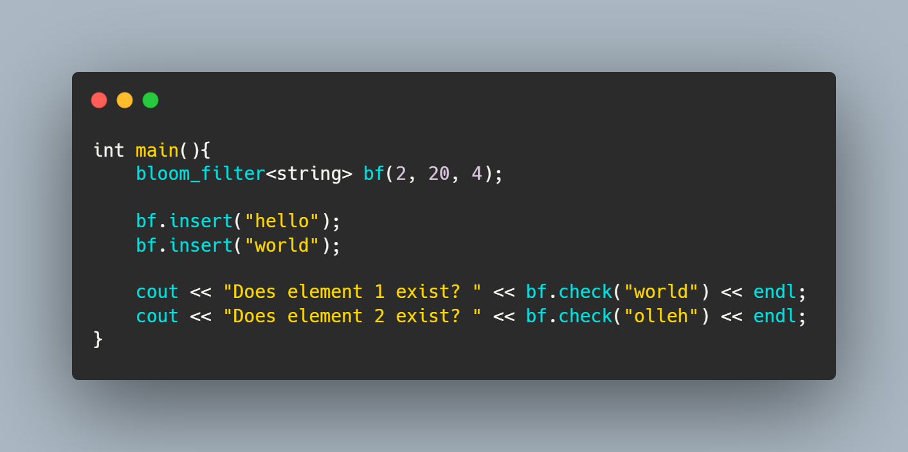

# Generic Bloom Filter
A light weight and easy to use Bloom Filter Library implemented in C++.
<p align="center"><p>


## Functionality
* Creating a bloom filter:
	* Method 1:
		
		`bloom_filter<Type>(false_positivity_rate, expected_number_of_elements)`
		
		Example:
		```cpp
		bloom_filter<string> bf(0.05,10);
		```

	 * Method 2:
	
		`bloom_filter<Type>(num_hash_functions, bit_array_size, expected_num_elements)`
		
		Example:
		```cpp
		bloom_filter<string> bf(3,100,50);
		```

* Inserting an element into the bloom_filter: `bf.insert(value)`
	
	Example:
	```cpp
	bf.insert(“test_email@gmail.com”);
	```

* Checking if an element exists in the bloom_filter: `bf.check(value)`
	
	Example:
	```
	bf.check(“test_email@gmail.com”);
	```

* Getter functions:
	 1. `bf.get_false_positive_rate()`
	 Here bf is the created bloom_filter and it returns the false_positive_rate.

	 2. `bf.get_num_hash_fn()`
	 Here bf is the created bloom_filter and it returns the number of hash functions.

	 3. `bf.get_bit_array_size()`
	 Here bf is the created bloom_filter and it returns the size of the bit_array.

	 4. `bf.get_expected_num_elements()`
	 Here bf is the created bloom_filter and it returns the expected number of elements.


## Simple Example
```cpp
#include<iostream>
#include "bloom_filter.hpp"
using namespace std;

int main(){
	bloom_filter<string> bf(2, 20, 4);		// parameters -> (num of hash functions, bit array size, expected num of elements)

	// Inserting elements into the bloom filter
	bf.insert("sahith@gmail.com");
	bf.insert("om@gmail.com");
	bf.insert("saksham@gmail.com");

	// Querying whether the elements exist in the bloom filter
	cout << "Does element 1 exist? " << bf.check("sahith@gmail.com") << endl;	// true
	cout << "Does element 2 exist? " << bf.check("mo@gmail.com") << endl;		// false
}
```

## Testing
### Linux
#### Constructor 1
Needs FPR, Expected Number of Elements.
```bash
# To run string test cases
>> make run_string_1 TEST_FILE=500 FPR=0.1 EXPECTED_INSERT=500

# To run int test cases
>> make run_int_1 TEST_FILE=500 FPR=0.1 EXPECTED_INSERT=500

# To run double test cases
>> make run_double_1 TEST_FILE=500 FPR=0.1 EXPECTED_INSERT=500
```

#### Constructor 2
Needs Number of Hash functions, Bit Array Size, Expected Number of Elements.
```bash
# To run string test cases
>> make run_string_2 TEST_FILE=500 HASH_COUNT=5 BIT_COUNT=5000 EXPECTED_INSERT=500

# To run int test cases
>> make run_int_2 TEST_FILE=500 HASH_COUNT=5 BIT_COUNT=5000 EXPECTED_INSERT=500

# To run double test cases
>> make run_double_2 TEST_FILE=500 HASH_COUNT=5 BIT_COUNT=5000 EXPECTED_INSERT=500
```

### Windows
#### Constructor 1
```bash
# To run string test cases
>> g++ ./tests/test_string_1.cpp bloom_filter.hpp
>> a.exe 500 0.1 500

# To run int test cases
>> g++ ./tests/test_int_1.cpp bloom_filter.hpp
>> a.exe 500 0.1 500

# To run double test cases
>> g++ ./tests/test_double_1.cpp bloom_filter.hpp
>> a.exe 500 0.1 500
```

#### Constructor 2
```bash
# To run string test cases
>> g++ ./tests/test_string_2.cpp bloom_filter.hpp
>> a.exe 500 5 5000 500

# To run int test cases
>> g++ ./tests/test_string_2.cpp bloom_filter.hpp
>> a.exe 500 5 5000 500

# To run double test cases
>> g++ ./tests/test_string_2.cpp bloom_filter.hpp
>> a.exe 500 5 5000 500
```

## Contributing
Pull requests are welcome. For major changes, please open an issue first to discuss what you would like to change.

Please make sure all the above tests pass before opening a pull request.

## License
[MIT](https://github.com/Sahith02/Bloom-Filter-CPP/blob/master/LICENSE)
